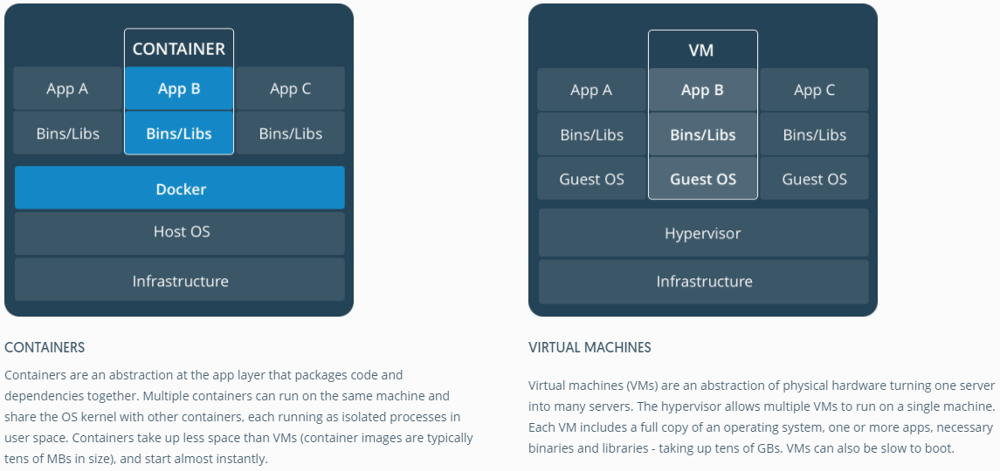
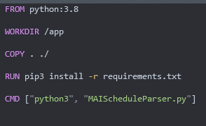
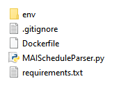
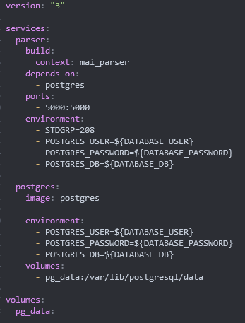
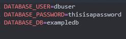
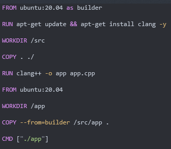

# Содержание

- [Содержание](#содержание)
- [Что такое докер и зачем он нужен?](#что-такое-докер-и-зачем-он-нужен)
  - [Контейнеризация](#контейнеризация)
  - [Docker](#docker)
- [Установка](#установка)
- [Основы](#основы)
  - [Dockerfile](#dockerfile)
    - [FROM](#from)
    - [WORKDIR](#workdir)
    - [COPY](#copy)
    - [RUN](#run)
    - [CMD](#cmd)
  - [Сборка](#сборка)
- [Часть два](#часть-два)
  - [Кеширование](#кеширование)
  - [.dockerignore](#dockerignore)
  - [USER](#user)
  - [Проброс портов](#проброс-портов)
  - [ENV](#env)
  - [Запуск новой версии](#запуск-новой-версии)
- [Часть три](#часть-три)
  - [Docker Compose](#docker-compose)
    - [build](#build)
    - [depends_on](#depends_on)
    - [ports](#ports)
    - [environment](#environment)
    - [image](#image)
    - [volumes](#volumes)
  - [Внутренняя сеть](#внутренняя-сеть)
  - [.env](#env-1)
  - [Запуск](#запуск)
- [Часть 4](#часть-4)
  - [stages](#stages)
  - [ARG vs ENV](#arg-vs-env)
  - [Docker Registry](#docker-registry)
  - [Чем бывает полезен при сборке приложений](#чем-бывает-полезен-при-сборке-приложений)
- [Послесловие](#послесловие)

# Что такое докер и зачем он нужен?

## Контейнеризация

Если попытаться просто пересказать, зачем нужна контейнеризация, ответ будет таков: контейнеризация позволяет разворачивать любые приложения где угодно. Представьте себе, что ваше приложение использует, к примеру, python и какие-то конкретные модули, причём версия модулей имеет значение. Разворачивать окружение на другой машине может быть довольно неприятно: прийдётся вручную заходить и настраивать окружение, возможно, даже устанавливать сам python. Теперь представьте, что вы занимаетесь только разработкой приложения, а разворачиванием приложения занимается кто-то другой. Или же ваше приложение будет запускать конечный пользователь. В таком случае, на машине может даже не быть установлен сам python, не говоря уже о конкретных зависимостях. Безусловно, вы можете оставить инструкции по установке, однако, на отличающейся машине что-то спокойно может пойти не так. Гораздо надёжнее будет поместить приложение в контейнер и распространять его в таком виде, тогда окружение не будет отличаться в зависимости от машины. 
Кроме того, за счёт повторяемости и простоты разворачивания приложения у нас появляются дополнительные удобства, так, например, становится намного легче процесс разворачивания нескольких копий одного приложения, что позволяет, например, сбалансировать нагрузку, если одна копия не справляется. Такой подход популярен в микросервисной архитектуре.

## Docker

Docker - ПО для создания контейнерезированных приложений. Суть контейнеров в том, что они предоставляют приложение вместе со всеми зависимостями, необходимыми для работы оного, а также позволяют поддерживать на разных машинах одинаковое системное огружение для оного.

Контейнеры местами напоминают виртуальные машины, однако в плане ресурсов контейнеры намного выгоднее виртуальных машин за счёт того, что вместо развёртывания полноценной ОС для создания виртуального окружения, котнейнерный движок (в нашем случае docker) использует напрямую ресурсы операционной системы хоста.

# Установка

Для того, чтобы начать знакомиться с докером поближе, прежде всего его необходимо установить.

Пользователи Windows и MacOS могут скачать установщих последующей ссылке: https://www.docker.com/products/personal

Кроме того, пользователи MacOS могут установить докер через brew: `brew install --cask docker`

Пользователи Linux наверняка и сами знают, как установить через свой пакетный менеджер.

После установки докера и всех необходимых компонентов (а также перезагрузки под виндой) стоит убедиться, что докер работает. Для этого в консоли наберите: `docker -v`

Если всё работает, вам выведется информация об установленной версии докера.

# Основы

## Dockerfile

Краеугольным камнем для работы с докером станет Dockerfile. Это файл, в котором описаны шаги по настройке окружения для вашего приложения. Сам файл имеет следующую структуру.

На основе докерфайла собирается образ (image) вашего приложения. Тут стоит пояснить, в чём различие между образом и контейнером. Образ - неизменяемый, его мы получаем в результате сборки нашего докерфайла, именно из него будут разворачиваться наши контейнеры. Сам по себе он является специальным "эталоном", с которого и копируются наши контейнеры, потому и не меняется в рамках одной версии.

В то же время контейнер - это запущенное из образа приложение. В отличие от образа, состояние контейнера меняется, так как наша программа в нём непосредственно исполняется, и может модифицировать своё окружение. 

Итак, как же нам создать образ? Для начала, необходимо написать докерфайл.

### FROM
Начнём с первого из необходимых нам ключевых слов. FROM объявляет, какой должен быть использован базовый образ в основе вашего. Например, вы можете использовать чистый образ Ubuntu linux, или же выбрать образ, в котором уже за вас установили ваш инструментарий, будь то npm или python. Сама суть в том, что мы указываем, на основе какого образа мы будем создавать свой, модифицируя его. 

### WORKDIR
Указываем рабочую директорию. Рабочая директория - директория, в которой будут выполняться некоторые из команд, о которых мы поговорим позже, таких, как `RUN`, `COPY`, `CMD`. Указать рабочую директорию стоит, так как иначе можно забыть указать полный путь в команде, и она попытается выполниться для рута файловой системы, что может привести к неожиданным последствиям. 

### COPY
Копируем файлы из файловой системы хоста в файловую систему контейнера. Именно так исходники нашей программы и попадают в контейнер. Первый аргумент - путь в хостовой ФС, второй - в гостевой. (Если обратить внимание на предыдущий пункт в примере, можно заметить, что в гостевой текущий путь будет /app, а потому копироваться будет в /app/)

### RUN
Выполняет команду в процессе сборки образа. В примере нам необходимо выполнить команду `pip install`, чтобы установить зависимости, что мы и делаем.

### CMD
Данной командой мы указываем энтрипоинт контейнера - иными словами, то, что будет запущено, когда мы запустим его. Заметьте, что аргументы пишутся не в одну строку, а как массив строк.

## Сборка
Теперь, давайте соберём и запустим наш пример из директории `mai_parser_1`. 
Для сборки образа используется команда `docker build`. При этом, нам бы хотелось дать нашему образу название, чтобы у нему удобнее было обращаться. Сделать это можно при помощи аргумента `-t`.

Тогда полная команда будет выглядеть следующим образом: `docker build . -t parser_v1`

Запустим её, и мы получим наше собранное в образ приложение. Теперь осталось запустить его командой `docker run parser_v1`

Если всё сделать правильно, на экране мы увидим результаты работы нашей программы из контейнера.

# Часть два
Итак, нам удалось собрать и запустить контейнер. Это замечательно, но не стоит на этом останавливаться. Познакомимся подробнее с ещё несколькими принципами докера.

## Кеширование
Один из важнейших принципов работы сборщика докера - кэширование. Каждая команда, которую мы пишем, например `RUN`, изменяет состояние образа. Докер кеширует этот шаг, чтобы при отсутсвии изменений скопировать его результат при повторной сборке образа. Это стоит учитывать при написании файла. Так, для питона или nodejs, стоит сначала установить зависимости, а уже потом копировать все остальные файлы, это позволит сохранить эти шаги в кэше.

## .dockerignore
Если вы работаете с файлами образа локально, у вас могут появляться "лишние" файлы, которые не стоит добавлять в образ, по аналогии с гитом, например, локальное окружение питона. Так же, как и в случае с гитом, для этого есть специальный файл `.dockerignore`, в котором мы описываем, какие файлы не стоит включать при копировании.

## USER
Важно будет упомянуть, что по умолчанию внутри контейнера всё запускается с локальными root-правами. Хоть это и не равно рут-правам на хост машине, тем не менее, если злоумышленник получит доступ к контейнеру через процесс приложения, он сможет делать что угодно. Для того, чтобы изменить пользователя, от которого запускаются процессы и команды, используется команда `USER`. Важно указать не только имя пользователя для запуска команд, но и группу (через двоеточие), иначе по умолчанию она будет root (особенность докера). Пример: `USER user:user`

## Проброс портов
Наше приложение из примера улучшилось. Оно переехало в директорию `mai_parser_pt2`, и теперь не только умеет парсить расписание, но и отдавать распарсенное по GET-запросу. Однако, наш запрос не может просто так попасть внуть контейнера. Для того, чтобы запрос попал в контейнер, нам нужно будет пробросить туда порт. Речь об этом пойдёт при сборке нового образа. Однако, важно обозначить для возможного пользователя нашего образа, какие именно порты внутри нашего контейнера нужно пробросить. Для этого используется ключевое слово `EXPOSE`.

##  ENV
Иногда нам нужно задать какие-то переменные окружение, которые потом будут прочитаны приложением. Сделать это можно при помощи ключевого слова `ENV`. Значения аргумента ENV могут быть как статически прописаны в докерфайле, так и динамически указаны при сборке. В примере мы можем поменять цифры группы, чтобы получить чужое расписание.

## Запуск новой версии
Теперь, когда у нас есть обновлённая версия приложения и докерфайла, давайте запустим её. Сама версия находится в директории `mai_parser_pt2`. Однако, как говорилось ранее, у нас не будет доступен ресурс внутри контейнера, если мы не пробросим порт. Для этого используем аргумент `-p HOST:TARGET`, где HOST - какой порт будет использоваться на хост-машине, TARGET - какой порт будет ему соответствовать внутри контейнера. Именно о таргетах мы извещаем командой EXPOSE.

Итого, запустим наш контейнер (при условии, что мы назвали его `parser_v2`) командой: `docker run -p5000:5000 parser_v2`

# Часть три
Хорошим тоном считается принцип один контейнер - один прицесс. Однако, как быть, если нужно запустить несколько процессов сразу? Например, бэкендр, фронтенд и базу данных? Для этого применяются различные инструменты оркестрирования: вы наверняка слышали о kubernetes, может даже о docker swarm. В нашем примере мы будем использовать такой же инструмент оркестрирования - docker compose. 
Кроме того, мы рассмотрим ещё несколько важных концептов при работе с контейнерами, например, как организовать постоянное хранение данных. 

## Docker Compose
Итак, как же нам воспользоваться docker compose? Его работа крутится вокруг описания конфигурации нашей системы в файле `docker-compose.yml`, с этого мы и начнём.

Сам файл представляет из себя описание конфигурации. Форматом является yaml, поэтому отступы критически важны, так как являются разделителями.

Первой указывается версия compose, которую мы используем. Это важно, так как в предыдущей версии некоторые механизмы работают иначе.

Затем идут секции описания объектов, таких, как сервисы (поднимаемые контейнеры) или подключаемых хранилищ.
Начнём с сервисов. Обозначаются ключевым словом `services`. В этой секции мы описываем, какие контейнеры необходимо создать, начиная с названия контейнера (В нашем слушае `parser` и `postgres`).

### build
`build` обозначает, что образ для контейнера необходимо предварительно собрать. Его подсекция `context` указывает, из какой директории будут выполняться команды для сборки, то есть, если у нас лежат в одной директории файл compose и директория с нашим приложением из приложением, которая называется `mai_parser`, мы указываем её название. Представьте, что перед исполнением команд вы просто хотите войти в указанное место через cd.

### depends_on
Указываем, что для работы котнейнеру необходимо, чтобы был запущен другой контейнер. Важно, если, например у нас идёт запрос к базе данных на старте: мы не хотим, чтобы запрос пошёл к ещё не запущеной базе.

### ports
Аналог команды -p для docker build, указываем, какие порты необходимо пробросить в контейнер.

### environment
Аналог ENV, задаём переменные окружения. Сами переменные могут быть как прописаны прямо тут, так и браться из .env файла (об этом позже).

### image
Если нам нужно взять готовый образ, а не собирать свой, например, как с базой данных в нашем случае, мы указываем название образа в регистре докера (поумалчанию в стандартном). Таким образом, вместо сборки образа, мы скачиваем готовый образ.

### volumes
Имеет аналог в виде команды VOLUME. Позволяет примонтировать директорию с хоста внутрь контейнера (либо просто создать специальное "хранилище"). Дело в том, что контейнеры не хранят состояние, и если нам необходимо сохранить данные (как, например, в случае с БД), нам необходимо сохранить их таким образом. 

Это же касается и секции volumes в compose-файле, здесь мы описываем какие хранилища мы создаём и как их настраиваем.

## Внутренняя сеть
Имея в сети базу данных, мы хотим иметь возможность к ней присоединиться. Однако, возникает вопрос: какой у неё будет хост-адрес? По умолчанию, docker compose создаёт внутреннюю сеть, в которой к контейнером можно обратиться по их именам. Так, в нашем случае, наша БД будет отвечать на `postgres`.

## .env
Если мы попытаемся сейчас запустить docker compose, мы обнаружим, что у нас не получается, потому что некоторые значения для переменных окружения, такие, как пароль для БД, мы указываем в виде переменной. Очевидно, что не стоит указывать такие данные в самом compose файле, поэтому вместо этого мы используем файл `.env`. Структура файла выглядит следующим образом:

Мы задаём пары ключ-значение. В самом же compose-файле мы можем получать значения по ключу, как, например, мы получаем имя пользователя при помощи `${DATABASE_USER}`

## Запуск
Одним из главных удобств использования docker compose является простота его использования. Чтобы запустить всё вместе, нам нужно всего лишь набрать команду `docker-compose up`

Чтобы остановить запущенный в фоне compose, есть команда `docker-compose down`

По умолчанию запускаются последние удачные образы, поэтому, если вам необходимо пересобрать перед запуском образы, используйте дополнительный флаг `--build`

Если вам необходимо убрать хранилища, используйте флаг `--volumes` с командой `docker-compose down`

# Часть 4
Мы рассмотрели самые основы работы с докером, однако стоит обсудить ещё несколько важных, на мой взгляд, концептов.

## stages
Всё это время мы собирали образ в одной стадии сборки, однако в докере их может быть несколько. Это очень удобно, когда, например, у нас используется не интерпретируемый язык, а компилируемый. Тащить за собой все исходники и сборочную информацию в итоговый образ может быть плохой идеей, в том числе, и с точки зрения безопасности. Для того, чтобы избежать этого, мы можем отдельно собрать приложение, и отдельно его запустить.

Размечаются стадии с помощью известной нам команды `FROM`. Для того, чтобы добавить секцию, просто указывается новый FROM с новым базовым образом. Однако, если мы собираем приложение в одной стадии, а запускаем в другой, мы должны его как-то скопировать в новую стадию? Обычное COPY копирует с файловой системы хоста. Для того, чтобы скопировать что-то из другой стадии, нужно сделать две вещи. Во-первых, добавить стадии метку при помощи команды `as`. Таким образом, у стадии теперь есть имя, по которому мы можем к ней обращаться. Во-вторых, для копирования мы добавляем к команде COPY аргумент `--from=` и указываем, из стадии с какой меткой мы будем копировать. В примере мы собираем приложение на C++ в стадии с именем builder, затем копируем готовый бинарник в новую стадию, из которой и запускается наше приложение.

## ARG vs ENV
Мы уже использовали ENV для того, чтобы задать переменные окружения. Однако, кроме этого, существует ещё команда ARG с очень похожим функционалом. В чём же их различия? Дело в том, что всё, что задаётся командой ENV, доступно приложению во время работы. Это может быть небезопасно, если мы, например, хотим передать какой-то токен или ссылку, необходимые для процесса сборки приложения, но не для исполнения. Именно для этого существует команда ARG: заданные ей переменные окружения действуют только **во время процесса сборки образа**.

## Docker Registry
Пользуясь докером, стоит знать, что образы откуда-то берутся и где-то хранятся. Для хранения образов существует такая вещь, как docker registry. Это своего рода специальный хост для всех образов. Можно как пользоваться стандартным, так и поднять свой собственный registry. Это позволяет быстро и удобно распространять собранные образы между разными компьютерами.

## Чем бывает полезен при сборке приложений
Ну и хотелось бы упомянуть, что докер бывает полезен не только для запуска приложений в любой среде, но порой и для вопроизведения среды для сборки, в случае, если эта среда сложновоспроизводима и/или требует каких-то особых условий, которые трудно выполнить на машине разработчика/билд-сервере.

Хороший пример такой ситуации можно прочитать в следующей статье на хабре, которая повествует о том, как докер применяется для сборки статических бинарников под Linux из C++:
https://habr.com/ru/post/591979/

# Послесловие
Докер - полезный и универсальный инструмент, который может помочь как в ситуации, когда необходимо развернуть сложную энтерпрайз-систему образов, так и просто когда не хочется ставить и поднимать базу данных для тестов на локальной машине. Докер позволяет очень удобно управлять окружением для разработки, тестов и запуска программ. Благодаря ему можно, например, поднять бэкенд для тестов, будучи фронтэнд-разработчиком и ничего не зная про то, как данный бекенд работает или собирается. Освоение докера может неплохо помочь с удобством процесса разработки.
