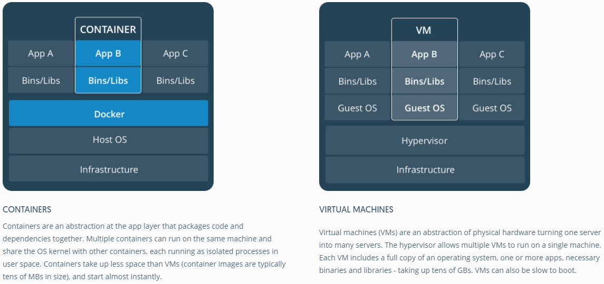
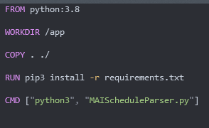
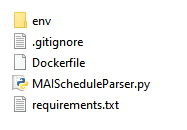

# Содержание

[Что такое докер и зачем он нужен?](#Что%20такое%20докер%20и%20зачем%20он%20нужен?)

# Что такое докер и зачем он нужен?

## Контейнеризация

Если попытаться просто пересказать, зачем нужна контейнеризация, ответ будет таков: контейнеризация позволяет разворачивать любые приложения где угодно. Представьте себе, что ваше приложение использует, к примеру, python и какие-то конкретные модули, причём версия модулей имеет значение. Разворачивать окружение на другой машине может быть довольно неприятно: прийдётся вручную заходить и настраивать окружение, возможно, даже устанавливать сам python. Теперь представьте, что вы занимаетесь только разработкой приложения, а разворачиванием приложения занимается кто-то другой. Или же ваше приложение будет запускать конечный пользователь. В таком случае, на машине может даже не быть установлен сам python, не говоря уже о конкретных зависимостях. Безусловно, вы можете оставить инструкции по установке, однако, на отличающейся машине что-то спокойно может пойти не так. Гораздо надёжнее будет поместить приложение в контейнер и распространять его в таком виде, тогда окружение не будет отличаться в зависимости от машины. 
Кроме того, за счёт повторяемости и простоты разворачивания приложения у нас появляются дополнительные удобства, так, например, становится намного легче процесс разворачивания нескольких копий одного приложения, что позволяет, например, сбалансировать нагрузку, если одна копия не справляется. Такой подход популярен в микросервисной архитектуре.

## Docker

Docker - ПО для создания контейнерезированных приложений. Суть контейнеров в том, что они предоставляют приложение вместе со всеми зависимостями, необходимыми для работы оного, а также позволяют поддерживать на разных машинах одинаковое системное огружение для оного.

Контейнеры местами напоминают виртуальные машины, однако в плане ресурсов контейнеры намного выгоднее виртуальных машин за счёт того, что вместо развёртывания полноценной ОС для создания виртуального окружения, котнейнерный движок (в нашем случае docker) использует напрямую ресурсы операционной системы хоста.

# Установка

Для того, чтобы начать знакомиться с докером поближе, прежде всего его необходимо установить.

Пользователи Windows и MacOS могут скачать установщих последующей ссылке: https://www.docker.com/products/personal

Кроме того, пользователи MacOS могут установить докер через brew: `brew install --cask docker`

Пользователи Linux наверняка и сами знают, как установить через свой пакетный менеджер.

После установки докера и всех необходимых компонентов (а также перезагрузки под виндой) стоит убедиться, что докер работает. Для этого в консоли наберите: `docker -v`

Если всё работает, вам выведется информация об установленной версии докера.

# Основы

## Dockerfile

Краеугольным камнем для работы с докером станет Dockerfile. Это файл, в котором описаны шаги по настройке окружения для вашего приложения. Сам файл имеет следующую структуру.

На основе докерфайла собирается образ (image) вашего приложения. Тут стоит пояснить, в чём различие между образом и контейнером. Образ - неизменяемый, его мы получаем в результате сборки нашего докерфайла, именно из него будут разворачиваться наши контейнеры. Сам по себе он является специальным "эталоном", с которого и копируются наши контейнеры, потому и не меняется в рамках одной версии.

В то же время контейнер - это запущенное из образа приложение. В отличие от образа, состояние контейнера меняется, так как наша программа в нём непосредственно исполняется, и может модифицировать своё окружение. 

Итак, как же нам создать образ? Для начала, необходимо написать докерфайл.

### FROM
Начнём с первого из необходимых нам ключевых слов. FROM объявляет, какой должен быть использован базовый образ в основе вашего. Например, вы можете использовать чистый образ Ubuntu linux, или же выбрать образ, в котором уже за вас установили ваш инструментарий, будь то npm или python. Сама суть в том, что мы указываем, на основе какого образа мы будем создавать свой, модифицируя его. 

### WORKDIR
Указываем рабочую директорию. Рабочая директория - директория, в которой будут выполняться некоторые из команд, о которых мы поговорим позже, таких, как `RUN`, `COPY`, `CMD`. Указать рабочую директорию стоит, так как иначе можно забыть указать полный путь в команде, и она попытается выполниться для рута файловой системы, что может привести к неожиданным последствиям. 

### COPY
Копируем файлы из файловой системы хоста в файловую систему контейнера. Именно так исходники нашей программы и попадают в контейнер. Первый аргумент - путь в хостовой ФС, второй - в гостевой. (Если обратить внимание на предыдущий пункт в примере, можно заметить, что в гостевой текущий путь будет /app, а потому копироваться будет в /app/)

### RUN
Выполняет команду в процессе сборки образа. В примере нам необходимо выполнить команду `pip install`, чтобы установить зависимости, что мы и делаем.

### CMD
Данной командой мы указываем энтрипоинт контейнера - иными словами, то, что будет запущено, когда мы запустим его. Заметьте, что аргументы пишутся не в одну строку, а как массив строк.

## Сборка
Теперь, давайте соберём и запустим наш пример из директории `mai_parser_1`. 
Для сборки образа используется команда `docker build`. При этом, нам бы хотелось дать нашему образу название, чтобы у нему удобнее было обращаться. Сделать это можно при помощи аргумента `-t`.

Тогда полная команда будет выглядеть следующим образом: `docker build . -t parser_v1`

Запустим её, и мы получим наше собранное в образ приложение. Теперь осталось запустить его командой `docker run parser_v1`

Если всё сделать правильно, на экране мы увидим результаты работы нашей программы из контейнера.

# Часть два
Итак, нам удалось собрать и запустить контейнер. Это замечательно, но не стоит на этом останавливаться. Познакомимся подробнее с ещё несколькими принципами докера.

## Кеширование
Один из важнейших принципов работы сборщика докера - кэширование. Каждая команда, которую мы пишем, например `RUN`, изменяет состояние образа. Докер кеширует этот шаг, чтобы при отсутсвии изменений скопировать его результат при повторной сборке образа. Это стоит учитывать при написании файла. Так, для питона или nodejs, стоит сначала установить зависимости, а уже потом копировать все остальные файлы, это позволит сохранить эти шаги в кэше.

## .dockerignore
Если вы работаете с файлами образа локально, у вас могут появляться "лишние" файлы, которые не стоит добавлять в образ, по аналогии с гитом, например, локальное окружение питона. Так же, как и в случае с гитом, для этого есть специальный файл `.dockerignore`, в котором мы описываем, какие файлы не стоит включать при копировании.

## USER
Важно будет упомянуть, что по умолчанию внутри контейнера всё запускается с локальными root-правами. Хоть это и не равно рут-правам на хост машине, тем не менее, если злоумышленник получит доступ к контейнеру через процесс приложения, он сможет делать что угодно. Для того, чтобы изменить пользователя, от которого запускаются процессы и команды, используется команда `USER`. Важно указать не только имя пользователя для запуска команд, но и группу (через двоеточие), иначе по умолчанию она будет root (особенность докера). Пример: `USER user:user`

## Проброс портов
Наше приложегие из примера улучшилось. Оно переехало в директорию `mai_parsesr_2`, и теперь не только умеет парсить расписание, но и отдавать распарсенное по GET-запросу. Однако, наш запрос не может просто так попасть внуть контейнера. Для того, чтобы запрос попал в контейнер, нам нужно будет пробросить туда порт. Речь об этом пойдёт при сборке нового образа. Однако, важно обозначить для возможного пользователя нашего образа, какие именно порты внутри нашего контейнера нужно пробросить. Для этого используется ключевое слово `EXPOSE`.

##  ENV
Иногда нам нужно задать какие-то переменные окружение, которые потом будут прочитаны приложением. Сделать это можно при помощи ключевого слова `ENV`. Значения аргумента ENV могут быть как статически прописаны в докерфайле, так и динамически указаны при сборке. В примере мы можем поменять цифры группы, чтобы получить чужое расписание.